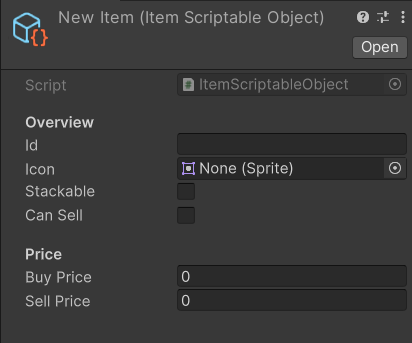
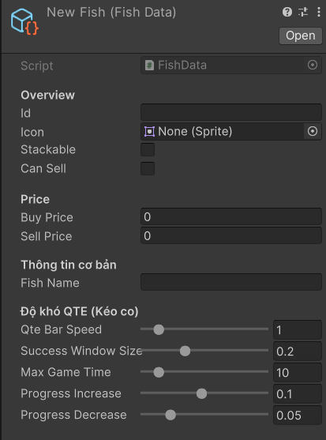

<link rel="stylesheet" href="https://cdnjs.cloudflare.com/ajax/libs/font-awesome/6.6.0/css/all.min.css">

# <i class="fa-solid fa-book"></i> Welcome

---
---
# <i class="fa-regular fa-bookmark"></i> Contents
[Nhân vật](#characters)  
[Cây trồng](#plants)  
[Cá](#fish)  
[Động vật](#animals)  
[Vật phẩm](#items)  
[Công trình](#constructs)  

---
---

# <i class="fa-solid fa-user"></i> Characters
> ## <i class="fa-solid fa-pencil"></i> Main Character set up
> Nhân vật chính di chuyển theo 4 hướng (Đông Bắc, Tây Bắc, Đông Nam, Tây Nam).
>
> ## <i class="fa-solid fa-clone"></i> Add a NPC

---
---
# <i class="fa-solid fa-seedling"></i> Plants
> 
> ## <i class="fa-solid fa-clone"></i> Add a plant

---
---
# <i class="fa-solid fa-fish"></i> Fish
> 
> ## <i class="fa-solid fa-clone"></i> Add a fish

---
---
# <i class="fa-solid fa-paw"></i> Animals
> 

---
---
# <i class="fa-solid fa-sack-dollar"></i> Items
> ## <i class="fa-solid fa-book"></i> Overview
> ### Chuẩn bị
> 
> ### Thiết lập vật phẩm
>   
>
> Các thành phần chính của một vật phẩm:
> - **Overview**:
>   - **Id**: Mã của vật phẩm.
>   - **Icon**: Hình ảnh của vật phẩm đó (icon trong kho đồ).
>   - **Stackable**: Vật phẩm có thể cộng dồn trong kho đồ được hay không.
>   - **Can Sell**: Vật phẩm có thể bán được hay không.
> - **Price**:
>   - **Buy Price**: Giá mua vào của vật phẩm _(Nếu vật phẩm không thể mua được thì đặt giá trị này là -1)_.
>   - **Sell Price**: Giá bán ra của vật phẩm _(Nếu vật phẩm không thể bán được thì đặt giá trị này là -1)_. 
> ## <i class="fa-solid fa-hammer"></i> Tools
> ## <i class="fa-solid fa-recycle"></i> Resources
> ## <i class="fa-solid fa-screwdriver-wrench"></i> Crafting
> ## <i class="fa-solid fa-carrot"></i> Crops
> ## <i class="fa-solid fa-fish"></i> Fish
> ### Chuẩn bị
> Các thành phần cần chuẩn bị để thiết lập cho Fish Item:
> - **Sprite Icon**: Đặt trong thư mục *Assets/Sprites/Items/Icons/Fish*.
> ### Thiết lập Fish Item
>   
> 
> Các thành phần chính của Fish Item:
> - Các thành phần từ Item cơ bản.
> - **Thông tin cơ bản**:
>   - **Fish Name**: Tên loại cá.
> - **Độ khó QTE**:
>   - **QTE Bar Speed**: Tốc độ quay của QTE bar.
>   - **Success Window Size**: 
>   - **Max Game Time**: Thời gian câu tối đa.
>   - **Progress Increase**: Số điểm được cộng khi nhấn trúng.
>   - **Progress Decrease**: Số điểm bị trừ khi nhấn trượt.
> ## <i class="fa-solid fa-egg"></i> Animal products
> ## <i class="fa-solid fa-bowl-rice"></i> Food
> ## <i class="fa-solid fa-chair"></i> Decoration
> ## <i class="fa-solid fa-clone"></i> Other

---
---
# <i class="fa-solid fa-house"></i> Constructs
> 