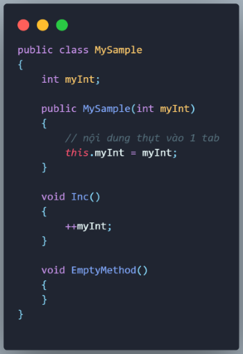
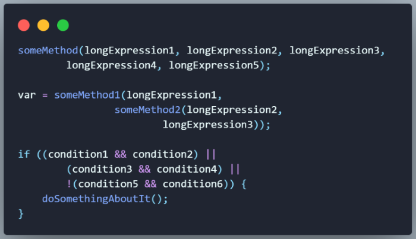
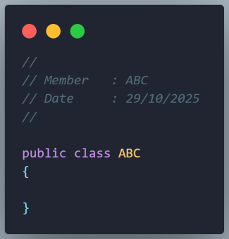
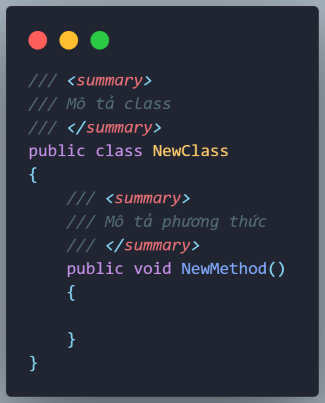
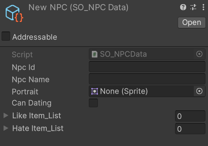
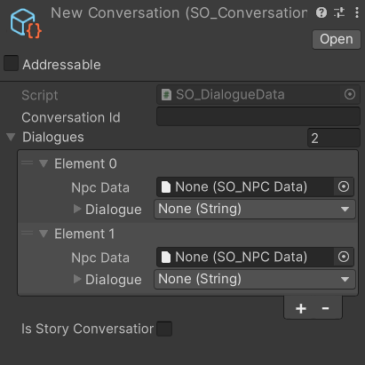
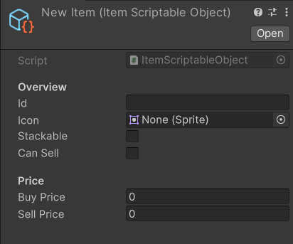
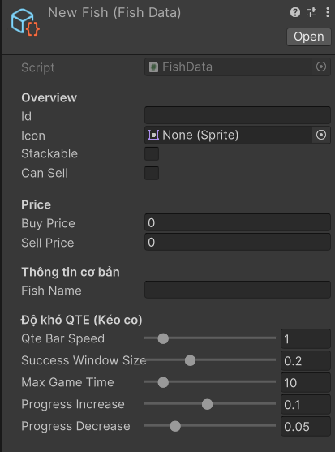
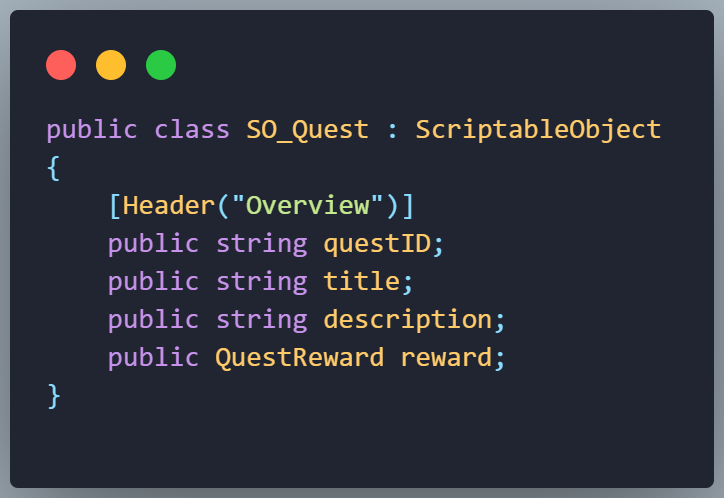
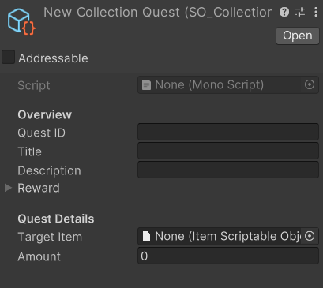

# Welcome

---

# Contents
- [Danh sách bảng](#table-list)
- [Hướng dẫn lập trình](#programming-guide)  
    - [Cấu trúc thư mục trong Unity](#unity-folder-structure)  
    - [Hướng dẫn tổ chức Scene](#scene-organization-guidelines)
    - [Hướng dẫn lập trình](#coding-guideline)  

- [Nhân vật](#characters)  
    - [Thiết lập nhân vật chính](#main-character-set-up)
    - [Dữ liệu NPC](#npc-data)
    - [Hội thoại](#npc-covnersation)
- [Cây trồng](#plants)  
- [Cá](#fish)  
- [Động vật](#animals)  
- [Vật phẩm](#items)  
    - [Tổng quan](#item-overview)
    - [Công cụ](#tools)
    - [Nguyên liệu](#materials)
    - [Chế tạo](#crafting)
    - [Nông sản](#crops)  
    - [Cá](#fish)
    - [Sản phẩm động vật](#animal-products)  
    - [Thức ăn](#food)
    - [Trang trí](#decoration)
    - [Vật phẩm khác](#other) 

- [Nhiệm vụ](#quests)

- [Công trình](#constructs)  
- [Dữ liệu](#data)
    - [Localization](#localization)
    - [Dữ liệu chung](#game-config)
    - [Dữ liệu nông trại](#farm-config)

---

# Table List
- [Bảng quy tắc đặt tên file](#files-name-guidelines-table)
- [Bảng quy tắc đặt tên trong code](#naming-guides-table)

---

# Programming Guide
> ## Unity Folder Structure
> Cây thư mục của dự án được tổ chức dưới dạng:  
> **Assets/** - Thư mục chính của dự án, chứa các thành phần trong trò chơi.
> - **Art/** - Chứa các thành phần đồ họa của trò chơi như model, animation, ...
>   - **Models/** - Chứa các model được dùng trong dự án.
>       - **Items/** - 
>           - **Icons/** - Chứa các sprite icon của vật phẩm.
>               - **Tools/**
>               - **Materials/**
>               - **Crafting/**
>               - **Crops/**
>               - **Food/**
>               - **Animal_Products/**
>               - **Decorations/**
>               - **Fish/**
>               - **Others/**
>           - **Sprites** - Chứa sprite cho các vật phẩm trong trò chơi, bao gồm các thư mục con tương tự trong thư mục Assets/Art/Models/Items/Icons/.
>   - **Animations/**
>       - **Animation Clips/** - Chứa các file animation clip.
>       - **Animator Controllers/** - Chứa các file animator controller.
>   - **VFX/** - Chứa các hiệu ứng hình ảnh cho trò chơi.
> - **Audio/**  
>   - **Music/** - Chứa các file nhạc trong trò chơi.
>   - **SFX/** - Chứa các file hiệu ứng âm thanh trong trò chơi.
> - **Scenes/** - Chứa các màn chơi trong trò chơi.
> - **Scripts/** - Chứa các file lệnh trong dự án.
>   - **Core/** - Chứa các lệnh về game logic.
>   - **User_Interfaces/** - Chứa các lệnh liên quan đến UI của trò chơi.
>   - **Managers/** - Chứa các lệnh liên quan đến quản lý các đối tượng trong trò chơi.
>   - **Scriptable_Obj** - Chứa các file script của các scriptable object.
>   - **Systems/** - Chứa các file lệnh liên quan đến hệ thống trò chơi.
> - **UI/**  
> - **Resources/** - Chứa các file scriptable object về dữ liệu của các thành phần trong trò chơi.
>   - **Items/** - *Chứa các Scriptable object của vật phẩm có trong trò chơi, bao gồm các thư mục con được liệt kê trong thư mục Assets/Art/Models/Items/Icons/*.
>   - **Prefabs/** - Chứa các prefab dùng trong dự án, có thể chia ra làm nhiều thư mục con để quản lý.
> 
> ---
> 
> ### Files name guidelines table
> | Loại file | Quy tắc đặt tên |
> | --------- | --------------- |
> | File animation clip | ANIM_<tên_animation> |
> | File animator controller | AC_<tên_file> |
> | File visual effect | VFX_<tên_file> |
> | File nhạc | MUS_<tên_file> |
> | File sound effect | SFX_<tên_file> |
> | Prefab | PFB_<tên_prefab> |
> | Scene | SCN_<tên_scene> |
> | Script logic game (Core) | C_<tên_script> |
> | Script UI | UI_<tên_script> |
> | Script quản lý | MGR_<tên_script> |
> | Script hệ thống trò chơi | SYS_<tên_script> | 
> | Scriptable object | SO_<tên_script> |
> 

---

> ## Scene Organization Guidelines
>
> Cách thức tổ chức Scene trong dự án  
>> | **SCENE** | |
>> | --- | --- |
>> | +-- **SYSTEMS** | |
>> | &nbsp;&nbsp;&nbsp;&nbsp;&nbsp;&nbsp; +-- **Game_Manager** | Chứa các thành phần quản lý chung của scene/trò chơi. |
>> | &nbsp;&nbsp;&nbsp;&nbsp;&nbsp;&nbsp; +-- **Audio_Manager** | Chứa các thành phần quản lý âm thanh của scene/trò chơi. |
>> | &nbsp;&nbsp;&nbsp;&nbsp;&nbsp;&nbsp; +-- **UI_Manager** | Chứa các thành phần quản lý giao diện của scene/trò chơi. |
>> | &nbsp;&nbsp;&nbsp;&nbsp;&nbsp;&nbsp; +-- **Input_Manager** | Chứa các thành phần quản lý đầu vào của scene/trò chơi. | 
>> | &nbsp;&nbsp;&nbsp;&nbsp;&nbsp;&nbsp; +-- Others system manager ... | |
>> | +-- **ENVIRONMENT**  | |
>> | &nbsp;&nbsp;&nbsp;&nbsp;&nbsp;&nbsp; +-- **Isometric_Grid** | Chứa bản đồ isometric của màn chơi. |
>> | &nbsp;&nbsp;&nbsp;&nbsp;&nbsp;&nbsp;&nbsp;&nbsp;&nbsp;&nbsp;&nbsp;&nbsp;&nbsp;  +-- **Ground** | Chứa bản đồ isometric của nền đất (đất, đường đi, nước, ...)  |
>> | &nbsp;&nbsp;&nbsp;&nbsp;&nbsp;&nbsp;&nbsp;&nbsp;&nbsp;&nbsp;&nbsp;&nbsp;&nbsp;  +-- **Fishing** | Chứa các ô đánh dấu khu vực nước có thể câu cá. |
>> | &nbsp;&nbsp;&nbsp;&nbsp;&nbsp;&nbsp;&nbsp;&nbsp;&nbsp;&nbsp;&nbsp;&nbsp;&nbsp;  +-- **Decoration** | Chứa các đối tượng trang trí trong bản đồ. |
>> |    +-- **Lighting**  | |
>> |    +-- **Buildings** | Chứa các đối tượng công trình trong màn chơi. |
>> | +-- **INTERACTABLE**  | |
>> |    +-- **Collectibles** | Chứa các đối tượng có thể thu thập được trong màn chơi. |
>> |    +-- **Triggers** | |
>> |    +-- **Door** | |
>> | +-- **CHARACTERS**  | |
>> |    +-- **Player** | |
>> |    +-- **NPCs** | |
>> | +-- **VFX**  | |
>> |    +-- **Environment_FX** | |
>> |    +-- **Character_FX** | |
>> |    +-- **Event_FX** | |
>> | +-- **AUDIO**  | |
>> |    +-- **Ambiant_Sound** | |
>> |    +-- **Environment_SFX** | | 
>> |    +-- **Event_SFX** | |
>> | +-- **UI**  | |
>> |    +-- **Canvas_Main** | |
>> |    +-- **Canvas_Pause**  | | 
>  
> 

---

> ## Coding Guidelines
> 
> **Quy ước cách trình bày**
> - Dấu ngoặc nhọn: Cả dấu ngoặc đóng và ngoặc mở phải được đặt tại dòng mới.
> - Sau mỗi dòng lệnh bắt đầu cấu trúc, “mức” tăng lên 1 tab.
> - Sau mỗi dòng lệnh kết thúc cấu trúc, “mức” giảm đi 1 tab.
> - Các dòng lệnh cùng “mức” thụt vào đều nhau.
> - Các “mức” thụt vào cách đều nhau.
> - Ví dụ  
> 
> 
> - Khi một biểu thức dài hơn một dòng đơn, cần ngắt chúng theo nguyên tắc sau: 
>   - Ngắt sau dấu phẩy
>   - Ngắt trước toán tử
>   - Những quy ước ngắt có độ ưu tiên cao hơn sẽ được ưu tiên trước
>   - Dòng mới được thụt vào 2 tab 
>   - Với một biểu thức dài có sử dụng dấu ngặc đơn thì không nên ngắt dòng trong cặp dấu ngoặc đơn “( )”
>   - Ngắt dòng cho biểu thức if nên sử dụng quy tắc 2 tab do việc sử dụng 1 tab làm cho phần body của biểu thức khó theo dõi
> - Ví dụ  
> 
> 
> ---
> 
> **Comments**
> 
> Các block comment được dùng để mô tả files, được đặt ở đầu của mỗi file. Một block comment thì trước nó phải được đặt một dòng trống để phân cách nó với phần còn lại của code, tránh bị nhầm lẫn.  
> Quy ước cách viết block comment đặt ở đầu file  
>   
> 
> Documentation comment dùng để mô tả các class, interfaces, constructors, methods, và fields. Được đặt ở đầu class, interface, ...  
> Quy ước cách viết documentation comment  
> 
> 
> ---
> 
> **Khai báo**
> 
> Chỉ nên sử dụng mỗi khai báo trên một dòng.  
> Chỉ đặt các khai báo ở phần đầu của các block (class, method). Không nên đợi đến khi nào cần sử dụng rồi mới khai báo vì điều này có thể gây ra sự rối rắm.  
> 
> ---
> 
> **Quy ước đặt tên**
> 
> Người lập trình khi đặt tên phải có ý nghĩa và phải chỉ ra được mục đích của file / variable / control / method.  
> Nên tránh sử dụng các tên gần giống nhau.  
> Không nên sử dụng những tên khó hiểu, kể cả trong trường hợp nó chỉ làm biến đệm hoặc làm biến đếm.  
>   
> ### Naming guides table
> | Loại | Quy ước |
> | ---- | ------- |
> | Class/Interface | Bắt đầu bằng chữ in hoa.  Các Interfaces không có method nào thì nên thêm chữ I ở đầu |
> | Biến (Variables) | Phải được bắt đầu với một ký tự thường.  Các biến List nên thêm vào cuối chữ List.   Các biến Array có thể thêm vào cuối chữ Array.   ... |
> | Hằng (Constants) | Mọi hằng số phải được viết hoa tất cả các chữ và giữa các từ được liên kết với nhau bằng dấu gạch dưới.  Mọi hằng số phải được khai báo static. |
> | Phương thức (Methods) | Tên method phải bắt đầu bằng một chữ viết hoa.  Từ đầu tiên của tên method nên sử dụng “động từ”. |
> 

---

# Characters
> ## Main Character set up
> Nhân vật chính di chuyển theo 4 hướng (Đông Bắc, Tây Bắc, Đông Nam, Tây Nam).
>
> ---
> 
> ## NPC Data
> 
> ### Thiết lập NPC Data
> 
> 
> 
> Các thành phần của NPC Data:
> - **NPC Id**: Id của NPC
> - **NPC Name**: Tên của NPC
> - **Portrait**: Ảnh avatar của NPC
> - **Can Dating**: NPC có thể hẹn hò được không
> - **Like Item List**: Danh sách các [vật phẩm](#item) yêu thích của nhân vât.
> - **Hate Item List**: Danh sách các [vật phẩm](#items) mà nhân vật ghét.
> 
> Vị trí lưu trữ: NPC Data được lưu trong thư mục *Assets/Resources/NPC/NPC_Data*.
> 
> ---
> 
> ## NPC Covnersation
> 
> ### Thiết lập NPC Data
> 
> 
> 
> Các thành phẩn của NPC Conversation:
> - **Conversatoin Id**:
> - **Dialogues**: Danh sách các Câu thoại của cuộc hội thoại. Mỗi câu thoại gồm:
>   - *NPC Data*: [NPC Data](#npc-data) của nhân vật thực hiện câu thoại.
>   - *Dialogue*: Câu thoại của nhân vật. Là một Localization String.
> - **Is Story Conversation**: Cuộc hội thoại có nằm trong storyline không.
> 
> Vị trí lưu trữ: NPC Conversation được lưu trữ trong thư mục *Assets/Resources/NPC/NPC_Conversation*.

---

# Plants
> 
> ## Add a plant

---

# Fish
> 
> ## Add a fish

---

# Animals
> 

---

# Items
> ## Item Overview
> ### Chuẩn bị
> 
> ---
> 
> ### Thiết lập vật phẩm
>   
>
> Các thành phần chính của một vật phẩm:
> - **Overview**:
>   - **Id**: Mã của vật phẩm.
>   - **Icon**: Hình ảnh của vật phẩm đó (icon trong kho đồ).
>   - **Stackable**: Vật phẩm có thể cộng dồn trong kho đồ được hay không.
>   - **Can Sell**: Vật phẩm có thể bán được hay không.
> - **Price**:
>   - **Buy Price**: Giá mua vào của vật phẩm _(Nếu vật phẩm không thể mua được thì đặt giá trị này là -1)_.
>   - **Sell Price**: Giá bán ra của vật phẩm _(Nếu vật phẩm không thể bán được thì đặt giá trị này là -1)_. 
> 

---

> ## Tools
> ### Chuẩn bị
> Các thành phần cẩn chuẩn bị cho Tools Item:
> - **Sprite Icon**: Đặt trong thư mục *Assets/Art/Models/Items/Icons/Tools*.
> 
> ---
> 
> ### Thiết lập Tools Item
> Các thành phần chính của Tools Item:
> - Các thành phần từ [Item cơ bản](#item-overview).
> 
> Vị trí lưu trữ:
> - Scriptable Object Tools Item được lưu trong *Assets/Resources/Items/Tools*.
> 

---

> ## Materials
> ### Chuẩn bị
> Các thành phần cẩn chuẩn bị cho Materials Item:
> - **Sprite Icon**: Đặt trong thư mục *Assets/Art/Models/Items/Icons/Materials*.
>  
> ---
> 
> ### Thiết lập Material Item
> Các thành phần chính của Materials Item:
> - Các thành phần từ [Item cơ bản](#item-overview).
> 
> Vị trí lưu trữ:
> - Scriptable Object Materials Item được lưu trong *Assets/Resources/Items/Materials*.
> 

---
 
> ## Crafting
> ### Chuẩn bị
> Các thành phần cẩn chuẩn bị cho Crafting Item:
> - **Sprite Icon**: Đặt trong thư mục *Assets/Art/Models/Items/Icons/Crafting*.
>  
> ---
> 
> ### Thiết lập Crafting Item
> Các thành phần chính của Crafting Item:
> - Các thành phần từ [Item cơ bản](#item-overview).
> 
> Vị trí lưu trữ:
> - Scriptable Object Crafting Item được lưu trong *Assets/Resources/Items/Crafting*.
> 
 
---
 
> ## Crops
> ### Chuẩn bị
> Các thành phần cẩn chuẩn bị cho Crops Item:
> - **Sprite Icon**: Đặt trong thư mục *Assets/Art/Models/Items/Icons/Crops*.
>  
> ---
> 
> ### Thiết lập Crops Item
> Các thành phần chính của Crops Item:
> - Các thành phần từ [Item cơ bản](#item-overview).
> 
> Vị trí lưu trữ:
> - Scriptable Object Crops Item được lưu trong *Assets/Resources/Items/Crops*.
> 
 
---
 
> ## Fish
> ### Chuẩn bị
> Các thành phần cần chuẩn bị để thiết lập cho Fish Item:
> - **Sprite Icon**: Đặt trong thư mục *Assets/Art/Models/Items/Icons/Fish*.
>  
> ---
> 
> ### Thiết lập Fish Item
>   
> 
> Các thành phần chính của Fish Item:
> - Các thành phần từ [Item cơ bản](#item-overview).
> - **Thông tin cơ bản**:
>   - **Fish Name**: Tên loại cá.
> - **Độ khó QTE**:
>   - **QTE Bar Speed**: Tốc độ quay của QTE bar.
>   - **Success Window Size**: Vùng màu xanh quay tròn của minigame.
>   - **Max Game Time**: Thời gian câu tối đa.
>   - **Progress Increase**: Số điểm được cộng khi nhấn trúng.
>   - **Progress Decrease**: Số điểm bị trừ khi nhấn trượt.  
> 
> Vị trí lưu trữ:
> - Scriptable Object Fish Item được lưu trong *Assets/Resources/Items/Fish*.
> 
 
---
 
> ## Animal products
> ### Chuẩn bị
> Các thành phần cẩn chuẩn bị cho Animal products Item:
> - **Sprite Icon**: Đặt trong thư mục *Assets/Art/Models/Items/Icons/Animal_Products*.
>  
> ---
> 
> ### Thiết lập Animal products Item
> Các thành phần chính của Animal products Item:
> - Các thành phần từ [Item cơ bản](#item-overview).
> 
> Vị trí lưu trữ:
> - Scriptable Object Animal products Item được lưu trong *Assets/Resources/Items/Animal_Products*.
> 
 
---
 
> ## Food
> ### Chuẩn bị
> Các thành phần cẩn chuẩn bị cho Food Item:
> - **Sprite Icon**: Đặt trong thư mục *Assets/Art/Models/Items/Icons/Food*.
>  
> ---
> 
> ### Thiết lập Food Item
> Các thành phần chính của Food Item:
> - Các thành phần từ [Item cơ bản](#item-overview).
> 
> Vị trí lưu trữ:
> - Scriptable Object Food Item được lưu trong *Assets/Resources/Items/Food*.
> 
 
---
 
> ## Decoration
> ### Chuẩn bị
> Các thành phần cẩn chuẩn bị cho Decoration Item:
> - **Sprite Icon**: Đặt trong thư mục *Assets/Art/Models/Items/Icons/Decoration*.
>  
> ---
> 
> ### Thiết lập Decoration Item
> Các thành phần chính của Decoration Item:
> - Các thành phần từ [Item cơ bản](#item-overview).
> 
> Vị trí lưu trữ:
> - Scriptable Object Decoration Item được lưu trong *Assets/Resources/Items/Decoration*.
> 
 
---
 
> ## Other
 
---

# Quests
> 
> ## Quest Overview
> 
>  
> 
> Các thành phần cơ bản của một nhiệm vụ:
> - **Quest Id**: Id của nhiệm vụ.
> - **Tittle**: Tên của nhiệm vụ.
> - **Description**: Mô tả của nhiệm vụ.
> - **Quest Reward**: [Phần thưởng](#quest-reward) cho nhiệm vụ.
>  
> Nhiệm vụ được chia ra làm các loại:
> - Nhiệm vụ thu thập (Collection Quest).
> - Nhiệm vụ trò chuyện (Talking Quest).
> 
> ## Nhiệm vụ thu thập
> 
> Vị trí lưu trữ Collection Quest Scriptable Object: *Resources/Quests/...*.  
> Các bước thêm một nhiệm vụ thu thập: *Right click -> Create -> Scriptable Object -> Quest -> Collection Quest*.
> 
> 
> 
> Các thành phần của nhiệm vụ thu thập:
> - Các thành phần có trong [nhiệm vụ cơ bản](#quest-overview).
> - **Target Items**: Danh sách các item cần thu thập của nhiệm vụ.
>   - *Item*: [Vật phẩm](#items) cần thu thập.
>   - *Amount*: Số lượng vật phẩm cần thu thập.
> 
> ---
> 
> ## Nhiệm vụ trò chuyện
> 
> Vị trí lưu trữ Talking Quest Scriptable Object: *Resources/Quests/...*.  
> Các bước thêm một nhiệm vụ trò chuyện: *Right click -> Create -> Scriptable Object -> Quest -> Talking Quest*.
> 
> ---
> 
> ## Quest Reward
> 
> 

---

# Constructs
> 

---

# Data
> ## Game Config
> Vị trí lưu trữ: *Assets/StreamingAssets/GameConfig.json*
> Các thành phần được lưu trữ:
> 
> ---
>
> ## Farm Config
> Vị trí lưu trữ: *Assets/StreamingAssets/SavedFarms/<farm_name>.json*
> 
> ---
>
> ## Localization
> ### Localized Table Named
> **Quy tắc đặt tên value**: Camel Case (Bắt đầu bằng chữ thường, từ tiếp theo viết hoa chữ cái đầu), e.g. questTittle.carpFishing
> 
> | Phân loại | Bảng | Cách đặt value | 
> | --- | --- | --- |
> | Tên NPC | NPC_Name | npcName.<tên_npc> |
> | Mô tả NPC | NPC_Description | npcDesc.<mô_tả_npc> |
> | Câu hội thoại | Conversation | conv.<tên_cuộc_hội_thoại>.<tên_npc>.<thứ_tự_câu_thoại> |
> | Tên item cơ bản | ItemName | itemName.<tên_item> |
> | Mô tả item cơ bản | ItemDescription | itemDesc.<mô_tả_item> |
> | Tên item cá | ItemName | itemName.fish.<tên_item> |
> | Mô tả item cá | ItemDescription | itemDesc.fish.<mô_tả_item> |
> | Tiêu đề nhiệm vụ | QuestTittle | questTittle.<tiêu_đề_quest> |
> | Mô tả nhiệm vụ | QuestDescription | questDesc.<mô_tả_quest> |
> | Tên kỹ năng | SkillName | skillName.<tên_skill> |
> | Mô tả kỹ năng | SkillDescription | skillDesc.<mô_tả_skill> |
> | Thông báo, UI Text của gameplay | GameplayMessage | gMsg.<tên_thông_báo> |